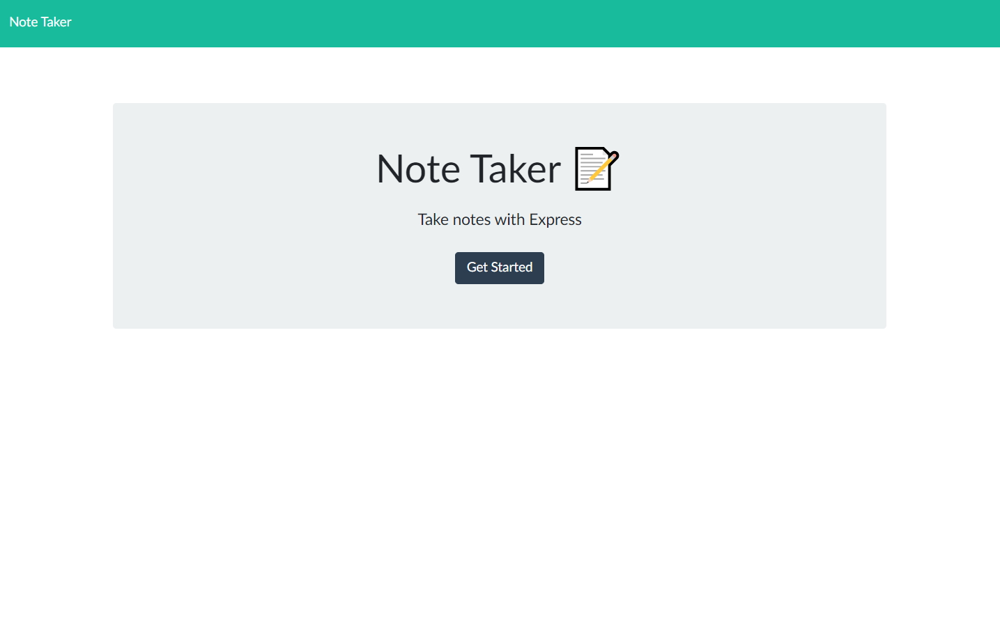
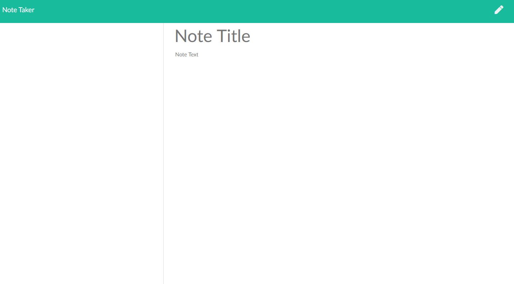
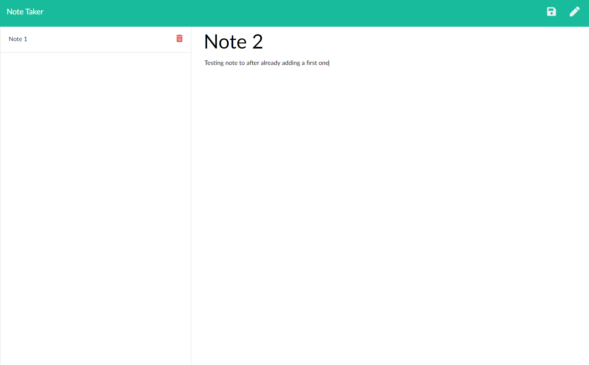
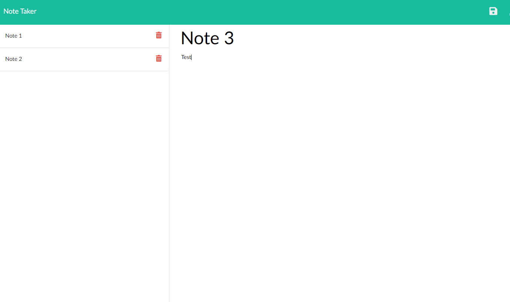

# Note-Taker

### Table of Contents
- [Description](#Description)
- [Technologies-Libraries](#Technologies-Libraries)
- [Screenshots](#Screenshots)
- [Link](#Link)
​
### Description
This is Note taker is powered with Jquery and can not only accept new notes but it can save them using both api and ajax calls to store the details!

​
### Technologies-Libraries
- [Bootstrap](https:https://getbootstrap.com/) - CSS Framework
- [Font Awesome](https://fontawesome.com/) - CSS Framework
- [JQuery](https://https://jquery.com/) - Javascript Language
​
### Screenshots

Landing Page

    
​

Adding Note page

​

Adding 2nd Note page

Adding 3nd Note page

​
### Link
Check it out!
 https://morning-fortress-81693.herokuapp.com/
